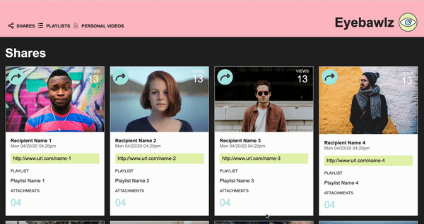

# Static Comp

This is a static comp challenge to get students "working that HTML/CSS muscle", where we were required to recreate a webpage based off of the provided static comp. The objective wass to build something that respects the integrity of the original design.

## Motivation and rubric

This project was completed as a project at Turing School of Software & Design during Module 2.

[The rubric is linked here.](https://frontend.turing.edu/projects/module-1/m1-static-comp)

## Reflections

Two challenges were focusing on mobile layout and responsive design. They are very important, so this was a great learning experince.

A big success was finishing most of the project three days before its due date. CSS and HTML are fun!

## Languages

Written in HTML & CSS

## Technology used

Built with Visual Studio Code

[Code stored on GitHub](https://hayleyw7.github.io/static-comp/)

[Project board on GitHub](https://github.com/users/hayleyw7/projects/3) 

## Access and use website

Enter the following URL in your internet browser:
`https://hayleyw7.github.io/static-comp/`

When the site loads, a user will see a navigation bar at the top of the page, and below that are two rows of four user information cards.

Since this is a static HTML and CSS practice assignment, nothing is clickable.

## GIF

<!-- replace this with a gif -->
 

## Future additions

* The user will be able to use and navigate the website via JavaScript.

* Actual information will be plugged into the hardcoded text placeholders.

## Contributors

Project completed by [Hayley Witherell](https://github.com/hayleyw7)

Project designed by instructors at Turing School of Art & Design
